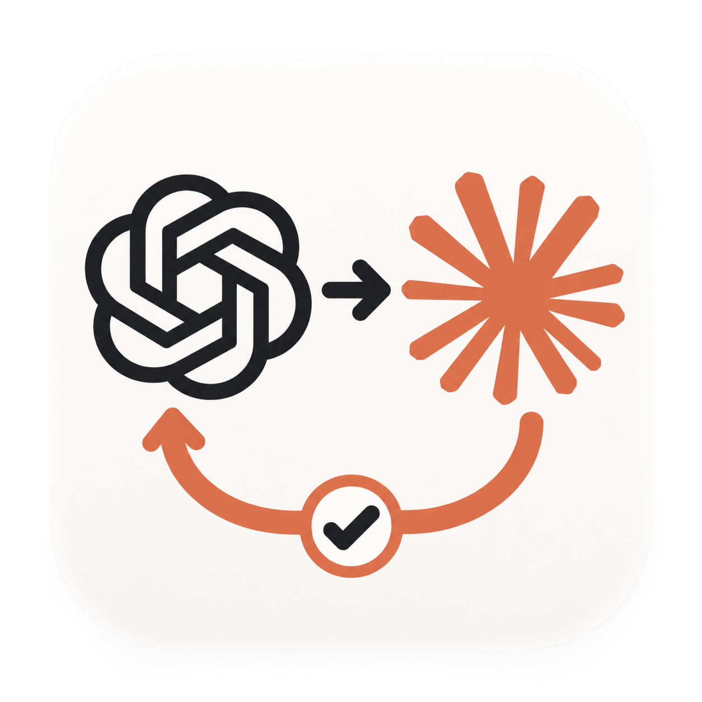

# Codex–Claude 协作 · 1.0.0

**简体中文** · [English](README.en.md)

<p align="center">
  
</p>

<p align="center">
  <strong>在 Codex 里，让 Claude 一起把事情做好。</strong><br>
  Codex 理解需求、派单并核验结果，Claude 在独立副本里实现或分析。<br>
  你在一个对话里掌握进展。
</p>

<p align="center">
  macOS · Codex 桌面端 · 本机 Claude Code<br>
  <a href="docs/getting-started.zh-CN.md">开始使用</a> ·
  <a href="#可以怎样使用">使用示例</a> ·
  <a href="https://github.com/BryanYue/codex-claude-orchestrator/issues">反馈问题</a>
</p>

## 它能帮你做什么

如果你同时使用 Codex 和 Claude，可能经常在两个窗口之间搬运需求、代码和审查意见。这个插件把协作放回 Codex：你描述目标，Codex 把你的原话、相关文件和它自己的理解分开交给本机 Claude Code，Claude 完成后交回报告和改动，再由 Codex 核验。

**提出任务 → Codex 派单 → Claude 实现或分析 → Codex 核验与反馈**

| 你想做的事 | 插件带来的帮助 |
| --- | --- |
| 按计划开发 | Claude 在独立副本里改代码、自己跑测试，交回 patch；Codex 核验后再应用到你的项目。 |
| 审查、评估方案、出计划 | Claude 先直接回答你的问题，再给依据；需要时可以在副本里复现。 |
| 随时知道进展 | 在协作工作台查看运行事实、Claude 的报告、它实际收到的任务书和 Codex 的裁决。 |
| 继续或纠正 | 在原对话里补充要求，下一轮接着做：你的新原话原样追加，Codex 的修正和逐项裁决也会带给 Claude。 |

正式版本：[`v1.0.0`](https://github.com/BryanYue/codex-claude-orchestrator/releases/tag/v1.0.0)（2026-10-08）。1.0 是一次断代重构：任务书改为按角色写的 Markdown，用户原话逐字直达；实现任务改到独立副本里执行并交回 patch；插件只报告事实和警告，不再替 Codex 判定失败。具体变化见[更新记录](CHANGELOG.md)，已执行的验证和未验证范围见[验证记录](RELEASE-VERIFICATION.md)。

## 开始使用

### 1. 准备好这三样

- **Codex 桌面端**：已登录，所在版本支持插件。[安装说明](https://developers.openai.com/codex/app)
- **Claude Code**：已在本机安装，并有可用的登录与额度。插件直接使用你本机的 Claude Code，不另外下载、更新或切换版本。[安装和登录说明](https://code.claude.com/docs/en/quickstart)
- **uv**：插件用它准备运行环境。[安装说明](https://docs.astral.sh/uv/getting-started/installation/)

面向 macOS。实现任务和默认的分析任务需要 macOS 自带的 `sandbox-exec` 来保护原仓库；不可用时，分析任务可以改用只读档。Intel Mac 尚未单独验证。

### 2. 安装插件

在终端中依次执行：

```bash
codex plugin marketplace add https://github.com/BryanYue/codex-claude-orchestrator.git --ref v1.0.0
codex plugin add codex-claude-orchestrator@codex-claude-team
```

第一条添加插件来源，第二条安装插件。仓库公开，无需 GitHub 邀请或登录。旧版本标签保持冻结；固定 ref 不会自动升级，切换按[版本切换步骤](docs/git-marketplace.md#change-a-fixed-ref-or-migrate-from-zip)操作。

**首次安装还需要准备依赖，再打开新 Codex 任务。** 不熟悉终端、遇到 `codex: command not found`，或以前装过本地版本，可以按[一步一步的安装指南](docs/getting-started.zh-CN.md)操作。

### 3. 从一次小任务开始

在 Codex 中打开你的项目，新建任务，把下面这段话发给它，并把文件名换成项目里的实际文件：

> 用 Codex–Claude 协作插件，让 Claude 看看 README.md 的安装步骤，新手最容易卡在哪里？先不要改文件，你核对它的结论后告诉我。

这是一次真实的 Claude 调用，会使用你的 Claude 额度。你会看到执行进度、Claude 的报告，以及 Codex 的核验结论。**报告交回不等于完成，Codex 核验后才算。**

## 可以怎样使用

**按计划实现**

> 按 docs/plan.md 第二阶段，让 Claude 实现导出改异步。完成后你检查 patch、跑测试，没问题再应用到项目里。

**先回答问题，再给依据**

> 让 Claude 评估一下把会话存储换成 SQLite 是否可行，重点看并发和迁移成本。先给结论。

**审查一次改动**

> 让 Claude 审查当前未提交的改动，只看错误处理和测试覆盖，在副本里复现它怀疑的问题。

**纠正方向**

> 这里理解错了：保留原来的登录流程，只修改错误提示。让 Claude 在上一轮的基础上改。

**查看进展**

> 打开这次协作的工作台。

文件名和任务内容只是示例，替换成你自己的即可。

## Claude 会收到什么、能做什么

- **任务书**：你的原话逐字放在最前面，接着是原件（规格、计划等）、Codex 的说明（标明“可能有误”）、约束（标明来自你、原件还是 Codex）和完成标准，并写明冲突时谁优先。Claude 实际收到的任务书可以在工作台里逐字查看。
- **副本档（默认，Git 项目）**：Claude 在你项目当前状态（含未提交改动）的独立 Git 副本里工作，可以编辑、运行命令和测试、使用 Agent/Skill/Workflow。原仓库、它的 `.git` 和插件的运行记录由 macOS 拒写；网络、凭证和其他本机路径不隔离，外部 MCP 关闭。`.env`、`.claude`、`.codex`、`.ssh` 等敏感的未跟踪文件不会复制进副本。
- **只读档**：在原目录只读，只能读取和搜索（经你同意可联网），通过结构化结果交回报告。适合普通文档目录，或你不希望执行任何命令时。
- **宿主指令**：Claude 照常加载你的全局和项目 `CLAUDE.md`、rules 与 hooks。插件会列出本次加载了哪些，并在任务书里写明：与任务书冲突时以任务书为准。

## 协作工作台里有什么

工作台把同一任务的多轮执行放在一起，并把三件事分开显示：**运行事实**（进程怎么结束）、**Claude 自称**（它对自己完成度的说法）和 **Codex 裁决**（接受、修正后接受或退回，以及下一步）。你还能看到事实性警告（例如改动碰了受保护路径、Claude 有问题需要你决定）、改动清单、报告和任务书原文。

页面只用于查看；补充要求、纠正方向和继续任务仍在 Codex 对话里进行。

## 你可能关心的问题

**需要两边都登录吗？会使用谁的额度？**

需要你自己的 Codex 和 Claude Code 使用权限。插件不提供或共享账号；Claude 实际执行和在线检查会使用 Claude 额度。只查看本地状态不会发起模型请求。

**代码会发到哪里？**

交给 Claude 的任务书和它读取的文件，会通过你的 Claude Code 配置发送给相应模型服务。工作台和运行记录保存在你的电脑上（默认 `~/.codex/claude-orchestrator/v1`）。请按项目要求决定哪些文件可以交给模型。

**会直接改我的项目吗？**

不会。Claude 只改副本；插件把改动整理成 patch，Codex 核验后用 `git apply` 应用到你的项目。插件不自动合并、提交或发布。

**任务进行中我还能改项目吗？**

可以。Claude 不在你的项目目录里工作。如果期间项目有变化，结果里会提示，Codex 应用 patch 前会先检查能否干净地应用。

**Codex 重启了，正在跑的任务怎么办？**

任务会继续运行，重新连接后用原来的任务编号查询即可。如果负责监督的进程意外退出，插件会停止残留的 Claude 进程，把这一轮记为中断，并收回已经写下的报告和改动。

**工作台里的 token 和费用是什么？**

“CLI 会话累计估算”按模型列出 Claude CLI 报告的累计用量与估算费用，包含子代理；续接会话的累计可能包含之前轮次。费用是 Claude CLI 的客户端估算，不是实际扣费或订阅剩余额度。

**从 0.7 升级要注意什么？**

1.0 不兼容旧任务：旧的运行记录保留在原目录供查阅，但不能续接；项目采用、自动选择执行者和协作说明在线管理已移除。详见[更新记录](CHANGELOG.md)。

## 进一步了解

| 你需要什么 | 去哪里看 |
| --- | --- |
| 从零安装与第一次使用 | [中文指南](docs/getting-started.zh-CN.md) · [English guide](docs/getting-started.en.md) |
| 更新、迁移与回退 | [Git marketplace 说明（英文）](docs/git-marketplace.md) · [安装与恢复](docs/install-and-recovery.md) |
| 运行细节与开发 | [进阶说明（中文）](docs/advanced-usage.zh-CN.md) |
| 本版变化与已验证范围 | [更新记录（中文）](CHANGELOG.md) · [验证记录（英文）](RELEASE-VERIFICATION.md) |

由 [BryanYue](https://github.com/BryanYue) 维护的社区项目，与 OpenAI、Anthropic 无官方隶属关系。当前未指定开源许可证。欢迎通过 [Issues](https://github.com/BryanYue/codex-claude-orchestrator/issues)反馈体验或提出建议。
